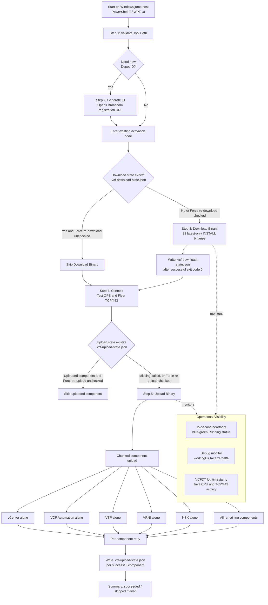
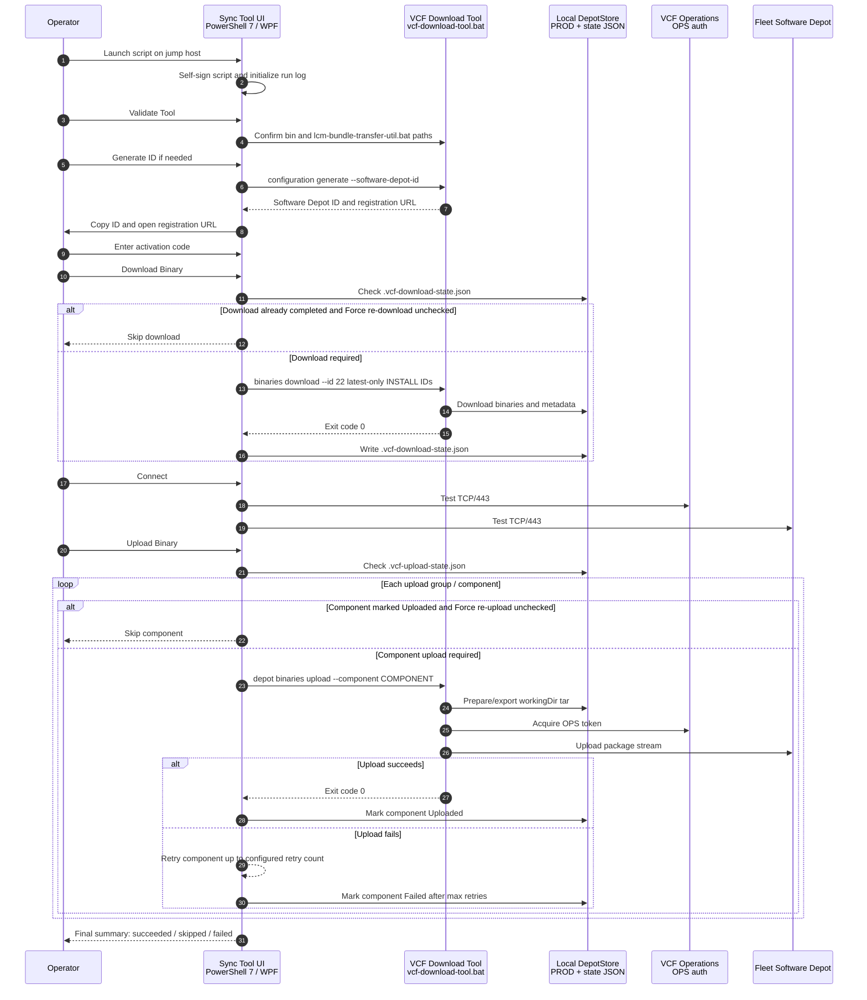

# VCF-9.1-Disconnected-Software-Depot-Sync-Tool

**Script Name:** `VCF9.1_Disconnected_Software_Depot_Sync_Tool_Rev1.1.ps1`  
**Release:** `Rev1.1 / UI v1.1.6-full`  
**Runtime:** PowerShell 7+ / WPF  
**Primary Use Case:** Simplify VCF 9.1 disconnected software depot download and Fleet Software Depot upload workflows.

Author Michael Molle

---

## Overview

`VCF9.1_Disconnected_Software_Depot_Sync_Tool_Rev1.1.ps1` is a PowerShell 7 WPF-based operational tool that wraps the Broadcom VCF Download Tool workflow in a safer, easier-to-operate UI. The tool is designed for disconnected or controlled-connectivity environments where binaries are staged locally and then uploaded into VCF Fleet Software Depot.

The tool improves the native command-line workflow by adding guided fields, repeatable workflow buttons, state tracking, chunked upload strategy, retry behavior, visible debug monitoring, and cleaner handling of long-running tar preparation and upload phases.

---

## Why Use This UI Instead of Only the Broadcom CLI Tools?

The Broadcom VCF Download Tool remains the underlying transfer engine. This UI does **not** replace the VCF Download Tool. Instead, this UI standardizes and simplifies how operators call the tool.

### Operational Benefits

- **Guided workflow:** Operators follow a consistent sequence: Validate Tool, Generate ID, Download Binary, Connect, and Upload Binary.
- **Reduced command-line errors:** Long command strings, activation-code file handling, OPS password-file handling, component filters, and depot paths are generated by the UI.
- **Safer secret handling:** Activation code and OPS password values are written to short-lived temp files only when the VCF Download Tool requires file-based input, then removed after use.
- **State-aware reruns:** JSON state files allow repeated runs without automatically reprocessing completed download or upload work.
- **Force controls:** Operators can intentionally override state with **Force re-download** or **Force re-upload** when a clean rerun is required.
- **Long-running task visibility:** The debug monitor reports tar growth, VCFDT log modification time, Java process CPU, and TCP/443 activity.
- **Better failure handling:** Uploads retry per component and continue to later components instead of stopping the entire workflow after the first component failure.

---

## Integrated Optional Binaries

The tool uses a curated 22-item latest-only INSTALL binary set for VCF 9.1. This includes core VCF components and optional/adjacent components such as **HCX**, VCF Operations components, VCF Automation, VSP, Fleet services, Salt components, and migration backend artifacts.

Including optional binaries such as **HCX** in the same controlled workflow helps ensure the disconnected depot is operationally complete for environments where these components may be required later. This avoids a common disconnected-site issue where the base platform binaries are synchronized, but optional lifecycle or service binaries are missing when an operator needs them.

The tool intentionally excludes vSAN Witness and File Services binaries from this curated set, based on the final script behavior and the operational focus of this sync workflow.

---

## Chunked Upload Strategy

Large all-in-one uploads can be fragile in constrained or long-running environments. This tool uploads in controlled chunks:

1. `VCENTER` alone
2. `VRA` / VCF Automation alone
3. `VSP` alone
4. `VRNI` alone
5. `NSX_T_MANAGER` alone
6. All remaining smaller components together

### Benefits of Chunking

- Reduces the size and duration of individual upload operations.
- Makes failures easier to isolate to one component or group.
- Improves retry behavior because only the failed component needs to be retried.
- Avoids repeating already-successful uploads when state tracking is active.
- Makes the long tar/export phase easier to reason about.

---

## Key Features

### Workflow and Usability

- Dark WPF UI.
- README button.
- Tool-path validation.
- Software Depot ID generation and clipboard copy.
- Activation-code based download.
- OPS and Fleet TCP/443 connectivity test.
- Chunked Fleet upload.
- Stop button for active background job.

### State Tracking

The tool uses two optional local state files in the DepotStore folder:

```text
.vcf-download-state.json
.vcf-upload-state.json
```

#### Download State

If `.vcf-download-state.json` shows the 22-item download set as complete for the selected VCF version and SKU, Step 3 skips the download unless **Force re-download** is checked.

#### Upload State

If `.vcf-upload-state.json` marks a component as uploaded for the selected VCF version, Step 5 skips that component unless **Force re-upload** is checked.

### Retry and Continuation

- Upload retry count is configurable in the UI.
- Default retry count is `3` attempts per component.
- Failed components are recorded and the workflow continues to later components.

### Debug Monitoring

When **Debug monitor** is checked, the UI logs operational status every 15 seconds while a job is running:

- `workingDir` tar file size and delta
- VCFDT `vdt.log` size and timestamp
- active Java/VCFDT-related process IDs
- process CPU total and delta
- TCP/443 connections for upload/download activity

---

## Prerequisites

- Windows jump host or management host.
- PowerShell 7+.
- VCF Download Tool extracted locally.
- Network access from the jump host to:
  - Broadcom download services when downloading binaries,
  - VCF Operations appliance,
  - Fleet Software Depot appliance.
- Valid Software Depot activation code.
- OPS local admin credentials for Fleet upload.

---

## How to Run

```powershell
Unblock-File .\VCF9.1_Disconnected_Software_Depot_Sync_Tool_Rev1.1.ps1

pwsh -ExecutionPolicy Bypass -File .\VCF9.1_Disconnected_Software_Depot_Sync_Tool_Rev1.1.ps1
```

---

## Standard Operating Procedure

1. Launch the tool from PowerShell 7.
2. Click **Validate Tool**.
3. If needed, click **Generate ID**.
4. Register the generated Software Depot ID in Broadcom portal and obtain the activation code.
5. Paste the activation code.
6. Confirm or adjust the download and upload directories.
7. Click **Download Binary**.
8. Use **Force re-download** only when intentionally re-running the full download.
9. Enter OPS/Fleet connection values.
10. Click **Connect** to validate TCP/443 reachability.
11. Enter OPS password.
12. Confirm upload retry count.
13. Click **Upload Binary**.
14. Use **Force re-upload** only when intentionally re-uploading components already marked complete.
15. Review the final summary for succeeded, skipped, and failed components.

---

## State File Examples

Download state file:

```text
.vcf-download-state.json
```

Upload state file:

```text
.vcf-upload-state.json
```

Example files are provided separately for testing skip behavior.

---

## Workflow Diagram



---

## Sequence Diagram



---

## Troubleshooting

### Download skips unexpectedly

Check for this file in the download directory:

```text
.vcf-download-state.json
```

If the state file marks the selected VCF version and SKU as downloaded, the tool skips Step 3 unless **Force re-download** is checked.

### Upload skips unexpectedly

Check for this file in the upload directory:

```text
.vcf-upload-state.json
```

If the component is marked `Uploaded` for the selected VCF version, the tool skips that component unless **Force re-upload** is checked.

### UI appears quiet during upload

Large components can spend significant time preparing/exporting tar content before progress is displayed. Keep **Debug monitor** checked to see tar size, VCFDT log timestamp, process CPU, and TCP activity.

### Upload fails with connection reset

The upload retry logic retries the failed component. If repeated failures occur at the same point, investigate network path, firewall, proxy, load balancer, Fleet Depot service health, and appliance resource pressure.

---

## Security Notes

- Passwords are not stored in configuration files.
- OPS password and activation-code temp files are removed after use.
- Logs may contain infrastructure names, component names, and operational paths.
- Store run logs and state files according to internal security requirements.

---

## License

Internal use. Provide attribution if reused or modified.

